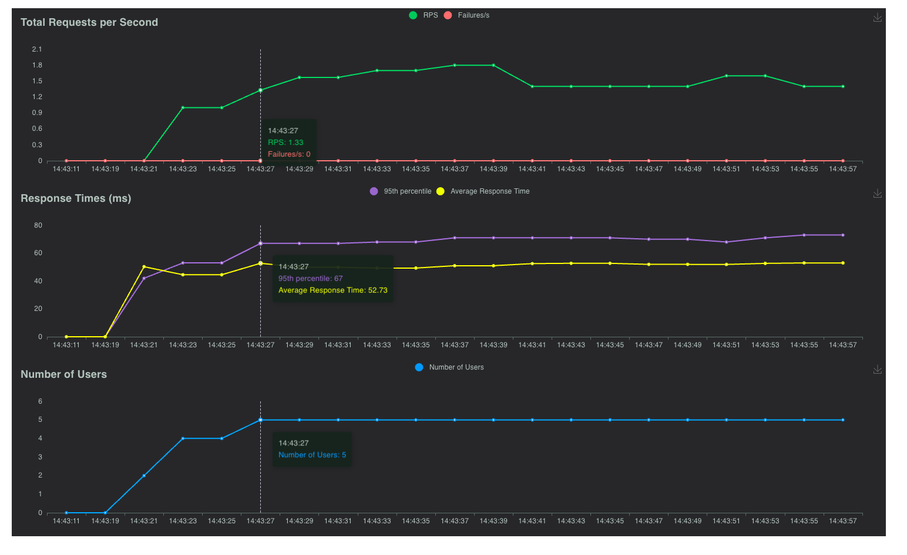

## Files
4 main files:
- `main.py`: FastAPI server. 
- `explore.ipynb`: model explorations and hyperparameter searching. 
- `requests.ipynb`: request test notebook to test API calls.
- `load_test.py`: locust load testing for concurrent users requirement

Data folders:
- `test_data`: created tests data for load testing etc.
- `models`: contains the models trained and stored with versions. API endpoints use this directory
- `reports`: contains the evaluation reports with versions. API endpoints use this directory
- `extend_data`: data to be extended for one of the use cases described

## Run the code

### To run the backend
Navigate the project directory and:

`uvicorn main:app --reload`

### To run load testing: 

`locust -f load_test.py`

Then, open browser and go to http://localhost:8089 to access the Locust web interface. Enter the number of users to simulate (e.g., 5) and the hatch rate (how quickly users are spawned), then start the test. Host is the backend endpoint default: http://localhost:8000. 

I have tested locally and works properly with simultaneously with 5 user (locust dashboard):

